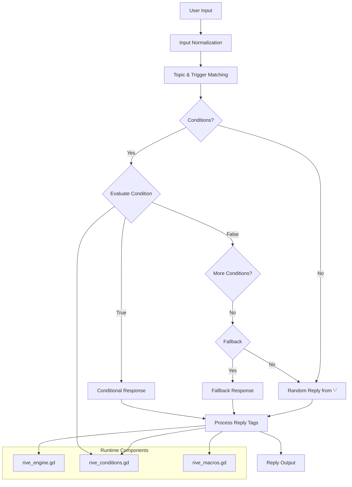
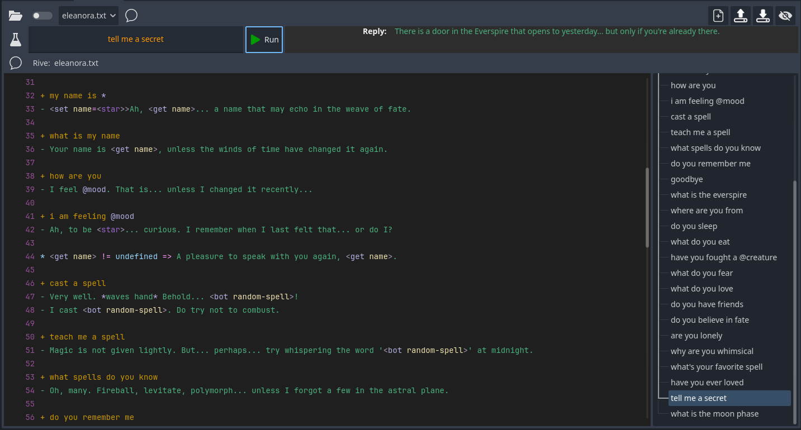

# GD-Rive (RiveScript Engine)

## Introduction
This custom RiveScript-inspired engine is designed for building deeply interactive, dynamic, and state-aware dialogue systems within Godot 4.x. 

It supports:

- Pattern-based triggers and responses
- Wildcards and substitutions
- Conditionals based on user memory, world state, or global systems
- Function-like macros and auto-loaded game state access
- Topic management and persona switching

#### What is RiveScript?

**RiveScript**, created by [AiChaos](https://github.com/aichaos), is a lightweight scripting language designed for writing dialogue-based or narrative AI and chatbots. It uses [human-readable syntax](https://www.rivescript.com/docs/tutorial) to define triggers (user inputs) and replies (bot responses), making it easy for writers and designers to craft conversational logic without deep programming knowledge. It intends a simple and intuitive approach to personalized and reactive dialogue. You can find out more [here](https://github.com/aichaos/rivescript).

In this project, it has been extended to integrate tightly with Godot, allowing scripts to interact with game state, call functions, and manage narrative flow through a custom engine. GD-Rive isn't a 1:1 analogue implementation of RiveScript, nor does it implement all features in the RiveScript working draft. It provides a condensed sub-set suitable for game authoring and coupling with the Godot Engine.

#### Why Another Dialogue System?

GD-Rive doesn't intend to replace or compete with other dialogue managers, but to provide an alternative for specific use cases where a fluid narrative dialogue is preferred. Leveraging RiveScript essentially transforms any character (enemy, npc, companion, etc) in your game into a story and game world immersive chat-bot. Instead of dialogue trees and branches, it provides a non-linear, open, context aware, conversation driven dialogue engine. This system is intended predominantly for Open Narrative Visual Novels, Text Based Adventures, TTRPG simulators, User Content Extension, Procedural Quest and Content Generation, and other such game formats and concepts. For a more traditional dialogue systems, the excellent [Dialog Manager by Natha Hoad](https://github.com/nathanhoad/godot_dialogue_manager) is strongly recommended.

---

## System Flow Diagram


---

## Getting Started

GD-Rive can be installed as a plugin into your `addons` folder. After initialisation, you will need to reload your project.

The plugin provides a rudimentary scripting interface to load `persona` files and `brain` files, featuring syntax highlighting and error indication. The **Rive Editor** also allows for testing, trigger, and topic discovery.



### Rive Files

Implementing custom file types in Godot is a non-trivial task and something beyond my capability at this time. For now, `rive` files are saved and stored with the `.txt` extension for editor and file system visibility. `Rive` files are separated into 2 conceptual categories:

- `brain` files
- `persona` files

To make development easier, GD-Rive relies on convention to differentiate between these file types.

#### Brain Files

Brain files represent the shared or general knowledge you want to exist between characters. This may be common substitions or generic topics such as lore or world building.

Example brain files are provided with the plugin when initialized.

#### Persona Files

Persona files represent the individual speakers and characters in your game world. They provide flavour, character, and personality, and specific character knowledge.

Example persona files are provided with the plugin when initialized.

### Pre-shipped Brain and Persona Files

- On first run, the following file paths will be created
	- `res://data/rive`
	- `res://data/personas`
	- `res://rive_engine`

### File Overview

#### `rive_engine.gd`
- Main interpreter and runtime handler for `rive` files. Accesible as RiveEngine
- Supports parsing, condition matching, macro execution, and global access.

#### `rive_macros.gd`
- Autoload singleton holding functions callable via `<call>`.
- Dynamically registered via `register_all_macros()`.

#### `rive_conditions.gd`
- Stores world and player state: boolean flags and flexible key-value data.
- Used by `<condition>`, `<flag>`, `<data>`, and `<get-global>` features.

### Folder Structure
```
res://
├── rive_engine/
│   ├── rive_macros.gd
│   └── rive_conditions.gd
├── data/
│   ├── rive/
│   │   ├── common.txt
│   │   ├── lore.txt
│   │   ├── emotes.txt
│   │   └── quests.txt
│   └── personas/
│       ├── eleanora.txt
│       ├── gronk.txt
│       └── sasha.txt
└── scenes/
	└── game_logic.tscn
```

- `data/rive/`: shared dialogue knowledge ("brain")
- `data/personas/`: individual character scripts

### Initializing the Engine
1. On startup, macros are auto-registered and `brain` files are loaded.
2. While the engine will function without a `persona`, it is recommended to call `switch_to_persona(persona)` before interaction.

### Public API
- `switch_to_persona(name)` — Load persona-specific `rive` + shared brain
- `reply(player_name, message)` — Get reply string from input
- `load_brain(files)` — Manually load brain `rive` files
- `load_persona(file)` — Load one persona `rive` file
- `reset()` — Clear internal state except user memory
- `get_all_topics()` — Returns topic names
- `get_triggers_for(topic)` — Lists triggers under a topic
- `get_topic_tree()` — Exports the full topic tree including all triggers
- `register_all_macros()` — Re-scan `RiveMacros` for callable methods
- `set_topic(player_name, topic_name)` — Force topic switch for a given character from outside of the conversation.
- `export_state()` — Exports the current state of the engine for saving in a custom resource or save system.
- `restore_state(state)` — Import a previously exported engine state.

---

## Tags / Keyword Overview

This section summarizes all core and extended tags and keywords available for scripting inside `rive` files.

An authoring guide and cheatsheet is hosted in the plugin's **Rive Editor** for quick reference (currently disabled as a window dialog due to a bug in responding to `close_requested` signal).

### Basic RiveScript Keywords
- `> topic` / `< topic` — Define and close a topic block
- `! sub` — Define input substitutions
- `! array` — Define reusable word groups
- `!flag` — set the value for a trigger-centric flag declaration
- `+` — Define a trigger (user input pattern)
- `-` — Define one or more replies
- `^` — Continuation of previous reply
- `*` — Use a wildcard in a trigger
- `<set>` / `<get>` — Store and retrieve user variables
- `! var` — Define bot-side variables (used via `<bot>`)

### Engine-Specific Extensions
- `<condition>` — Check flag or data from `RiveConditions`
- `<get-global>` — Compare global property/method in a condition
- `<flag>` — Set a boolean flag
- `<data>` — Set a numeric or string value
- `<set-global>` — Assign a value to a singleton's property
- `<global>` — Call a global method (no return)
- `<call>` — Call a macro from `RiveMacros`
- `<call-global>` — Call a method from any singleton and return its value

---

## RiveScript Core Features

This section breaks down the core constructs of a `rive` file. These elements form the foundational structure for defining character dialogue, memory, and pattern matching.

### `> topic` / `< topic`
```rive
> topic shop
+ buy *
- You bought <star>.
< topic
```
Topics group related triggers and replies into isolated scopes. This allows you to structure complex conversation systems without global keyword conflicts. 

#### Topic Switching

You can switch topics within the conversation flow with `<set topic=topic_name>` or use contextual rules to guide the conversation.

### `! sub`
```rive
! sub i'm = i am
! sub don't = do not
```
Substitutions help normalize input before pattern matching. They are applied globally to all user input to simplify trigger patterns. This improves flexibility by accounting for common contractions and phrasing differences.

### `! array`
```rive
! array color = red green blue
```
Use in triggers like `+ I like @color`

### `+` Trigger
```rive
+ hello
```
Defines a user input pattern to match. Triggers initiate dialogue flow. Patterns can include literal phrases or wildcard structures. Triggers are matched against normalized input after substitutions are applied.

#### Trigger Flags
You can configure per-trigger options using inline flags directly beneath a `+` trigger. These begin with `!flag` and set options for advanced matching or behavior.

Example:
```rive
+ [*] @yes [*]
!flag allow_mid_wildcard=true
- Affirmative.
```
The above enables mid-pattern wildcard matching for this trigger.

*_Other trigger flags tbd_*

### `-` Reply
```rive
- Hello!
- Greetings, traveler.
```
Replies are tied to the preceding `+` trigger. Multiple replies can be defined for variety. If conditions (`*`) exist, they are evaluated first. Replies can contain embedded tags that manipulate state or inject dynamic content.

#### `^` Continuation Line

The `^` tag allows you to extend a reply (`-`) across multiple lines in your `rive` file. This is useful for maintaining readability in scripts with long responses.

```rive
+ tell me a story
- Once upon a time, in a land far away,
^ there lived a dragon who hoarded secrets.
^ One day, a traveler dared to speak its name.
```

This will be treated as a single concatenated response:

```rive
Once upon a time, in a land far away, there lived a dragon who hoarded secrets. One day, a traveler dared to speak its name.
```

Notes:
- `^` must come after a `-` line; it cannot start a reply on its own.
- Continuation lines are automatically concatenated with a space; no need to add leading spaces.
- This is purely a formatting feature and provides no functional capability.
- Continuation lines are only relevant to `replies` and not supported for `triggers`.

### `*` Wildcard
```rive
+ my name is *
- Hello <star>.
```
Wildcards allow you to capture arbitrary user input. The captured content can be accessed in replies using `<star>`, `<star1>`, etc. This enables dynamic responses and memory assignment.

### `<set>` / `<get>`
```rive
<set name=John>
<get name>
```
These tags enable persistent user memory. `<set>` stores a key-value pair specific to the user, and `<get>` retrieves it during future interactions. This is foundational for building personalized, stateful conversations.

### `! var`
```rive
! var spell = {fireball|teleport|ice bolt}
```
Defines bot-side variables used in responses. These can be referenced with `<bot spell>` to inject randomly chosen or static content. Useful for adding flavor and unpredictability.

---

## Engine Extensions

### Conditionals
Conditionals allow dialogue to branch dynamically based on user memory, game state, or global values. Conditions are declared using `*` lines beneath a trigger (`+`). They are evaluated top-down, and the first matching condition returns the associated response.

#### Types of Conditions
- `<get var> == value`: checks a user-specific variable
- `<condition flag>`: checks a boolean flag in `RiveConditions`
- `<condition not flag>`: checks the negated value of a flag
- `<condition data.key op value>`: compares a data entry in `RiveConditions`
- `<get-global Singleton.method(...) == value>`: evaluates a global function or property

```rive
+ check status
* <get mood> == happy => You seem pleased.
* <condition has_key> => You open the gate.
* <condition not has_key> => You need the key.
* <condition data.hp >= 30> => You're healthy.
* <get-global Inventory.has_item("sword") == true> => You're ready.
```

#### Fallbacks
When a trigger has conditional responses, you can define a fallback using `**`. This line is used only if none of the `*` conditions match.

```rive
+ knock on door
* <condition door_open> => The door is already open.
** No one answers.
```

This ensures graceful degradation if no condition applies.

### Tag-Based State Control
State tags can be embedded in reply lines (`-`) to change memory, flags, or invoke system logic:

- `<flag key=bool>` sets a boolean in `RiveConditions`
- `<data key=value>` sets string or numeric data in `RiveConditions`
- `<set-global Singleton.prop = value>` assigns to a singleton variable
- `<global Singleton.method(...)>` invokes a global function (no return value)

```rive
+ take item
- You now have the key. <flag has_key=true>

+ train
- Your strength increases. <data strength=10>

+ enter forest
- Map updated. <set-global game_state.map = "forest">

+ complete quest
- Stage progressed. <global quest_tracker.advance(2)>
```

---

## Macros

Macros allow dynamic responses using callable logic defined in GDScript. They can return a value into the reply or trigger logic in the game via registered functions.

### `<call>` — Call Local Macro
Calls a GDScript method defined in `RiveMacros.gd`, which is registered at runtime.
```rive
+ what time is it
- It's <call>get_current_time</call>.
```
The `get_current_time()` function must exist in `RiveMacros` and return a string.

### `<call-global>` — Call Global Singleton Method
Invokes a method on any autoloaded singleton and inserts the return value into the response.
```rive
+ what time is it
- It's <call-global>Clock.get_time</call-global>.
```
You can also pass arguments:
```rive
- Status: <call-global>Player.get_status("mood")</call-global>
```

#### Best Practices
- Only expose methods meant to be accessed from dialogue.
- Avoid mutating state via return-based macros (use `<global>` if needed).
- Use return values strictly for response content.

---

## Global Access

Global access allows dialogue scripts to interact directly with autoloaded singletons in the Godot engine. This powerful feature makes it possible to inspect game systems and trigger changes from within dialogue, but it also requires thoughtful design.

### Key Considerations
- Global access can read or modify runtime state.
- Scripts should only access globals that are intended to be exposed.
- Prefer encapsulated, readonly methods where possible to avoid accidental state mutation.
- Scripts should only access globals that are intended to be exposed.
- `RiveEngine` uses `Engine.get_singleton()` internally to resolve singleton access; if the global / autoload does not live in this space, it will not be accessible.

---

## Example Dialogue
```rive
! sub i'm = i am
! array direction = north south east west
! var mood = {happy|sad|tired}
! var spell = {fireball|frostbolt|illusion|levitate|enchant|polymorph|banish|ward|scry}

> topic general
+ hello
- Greetings, traveler!
- Hello there.

+ i am feeling @mood
- I see. You are <star>.

+ what is your name
- My name is Eleanora of the Verdant Sigil.

+ my name is *
- <set name=<star>>Nice to meet you, <get name>.

+ where should i go
* <condition data.strength >= 10> => You are strong. Go <bot direction>.
** Just follow your heart.

+ give me the key
- Very well. <flag has_key=true>

+ open the door
* <condition has_key> => You unlock the door.
** It won't budge.

+ what is my strength
- You currently have <condition data.strength >= 10> => high strength.
- <condition data.strength < 10> => low strength.

+ train
- Your strength increases. <data strength=12>

+ what time is it
- It is <call-global>Clock.get_time</call-global>.

+ check inventory
* <get-global Inventory.has_item("sword") == true> => You are armed.
* <get-global Inventory.has_item("sword") == false> => You are unarmed.

+ update location
- Marked on map. <set-global Map.last_position = "dungeon">

+ tell me how you know this man
- It all started a long time ago... <global SceneManager.play("intro")>

+ cast a spell
- I cast <bot spell>!
< topic
```
